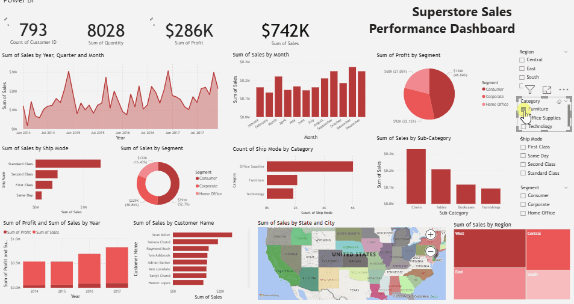

# 📊 Superstore Sales Dashboard — Power BI (2014–2017)

Dashboard ini dibuat menggunakan dataset *Superstore* dari Kaggle dan bertujuan memberikan insight mendalam mengenai performa penjualan, profitabilitas, perilaku pelanggan, kategori produk, serta pola pengiriman dalam periode empat tahun. Proyek ini menampilkan visual interaktif menggunakan Power BI dan menggabungkan teknik analisis berbasis DAX.

---

## 📂 Dataset

🔗 **Superstore Dataset – Kaggle**

[https://www.kaggle.com/datasets/vivek468/superstore-dataset-final](https://www.kaggle.com/datasets/vivek468/superstore-dataset-final)

---
## 🛠 Tools & Techniques

* **Power BI Desktop**
* **DAX (Data Analysis Expressions)**
* **Data Cleaning & Transformation**
* **Data Modeling & Relationships**
* **Interactive Slicer, Drilldown, & Tooltip Pages**
* **Time Intelligence (YTD, MoM, Trend Analysis)**

---

## 🔍 Key Insights

* Total **Sales: $2M**, **Profit: $286K**, dan **Quantity: 38K** selama 4 tahun.
* Penjualan **terendah** terjadi pada **Februari 2014** sebesar **$12,740**.
* Penjualan **tertinggi** terjadi pada **November 2017** sebesar **$89,313**.
* Metode pengiriman terbanyak: **Standard Class** dengan total penjualan **$1,358,299**.
* Segmen **Consumer** mendominasi sales (50.56%) dan profit (46.84%).
* Kategori **Office Supplies** memiliki jumlah pengiriman terbanyak (**6,026 shipments**).
* Sub-kategori dengan sales terbesar: **Phones ($330,047)**.
* Wilayah dengan kontribusi sales terbesar: **West ($725,511)**.

---

## 📊 Dashboard Preview 

## 🧠 What I Learned

* Mendesain dashboard end-to-end menggunakan Power BI
* Membuat model data dan relasi antar tabel
* Membuat DAX untuk analisis time intelligence
* Mendesain UI dashboard yang rapi: slicer, KPI, chart interaktif
* Membangun insight bisnis berbasis data

---

## 👤 Author

**Silvi Indah Lestari**
*Data Analyst | Excel | Power BI | Data Visualization*
